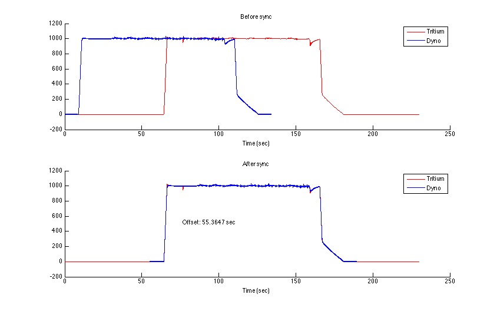

#sync_timeseries.m
*Find the time offset between two timeseries with similar data*

sync_timeseries was written to synchronize data from two data sources which log data using absolute times, but might have some offset between their clocks. 



##Usage
You should feed sync_timeseries two timeseries with the same or very similar data. For example, we use sync_timeseries with the motor RPM signals logged by the dynamometer and by our motor controller, which should be very similar.

Both of the timeseries should have the **same** time unit (usually seconds).

sync_timeseries(ts1, ts2) returns the time difference that should be *added* to ts2 in order to make the two match up. So:

```Matlab
offset = sync_timeseries(ts1, ts2)
ts2.Time = ts2.Time + offset
```

should result in a ts1 and a ts2 which are synchronized.
